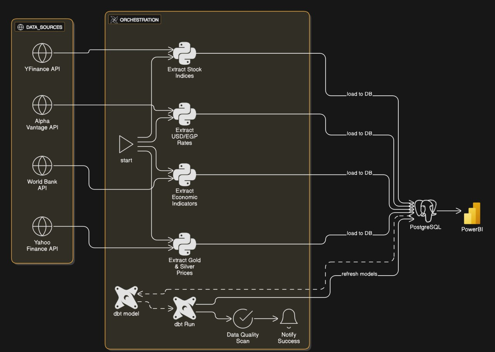
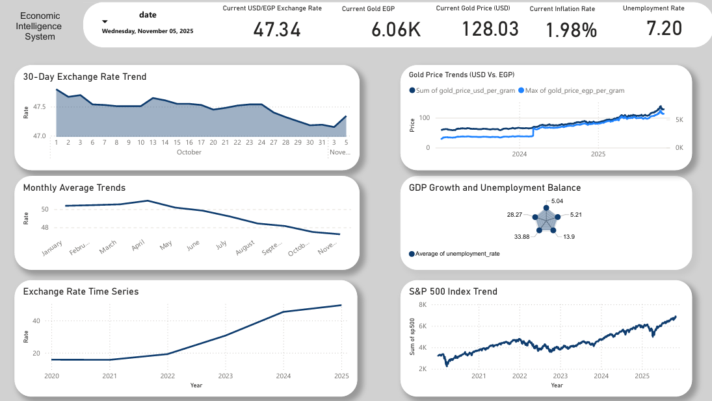
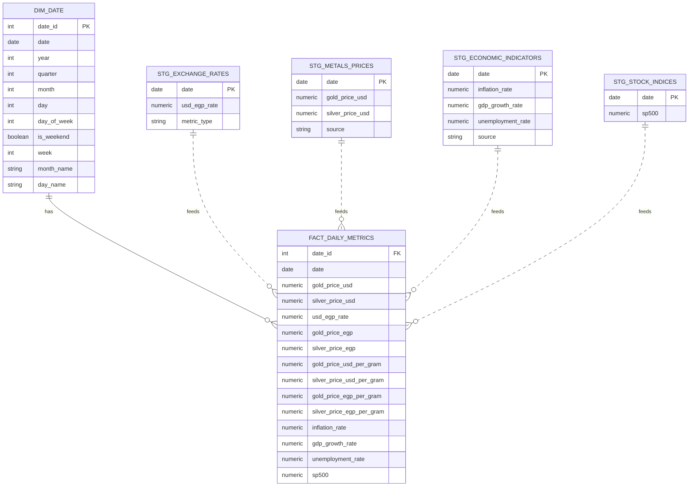
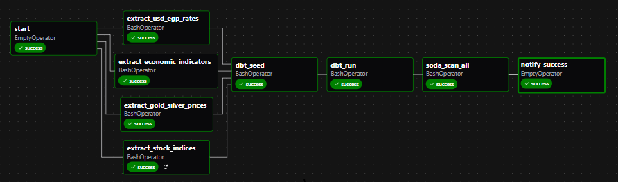

# Real Time EIS Pipeline

A comprehensive data pipeline that collects, transforms, validates, and analyzes Egypt's economic indicators in real-time using modern ETL architecture.

## Overview
**The Economic Intelligence System (EIS)** monitors key economic metrics including USD/EGP exchange rates, precious metals prices, macroeconomic indicators, and stock market indices. 
The system implements a star schema data warehouse on PostgreSQL, orchestrated by Apache Airflow with dbt for transformations and Soda Core for data quality validation,  and enables real-time monitoring through Power BI dashboards.

## Architecture

### Pipeline Stages

### Extract 
Python scripts fetch data from external APIs:
- USD/EGP exchange rates (Alpha Vantage)
- Gold & silver prices (Yahoo Finance)
- Economic indicators (World Bank API)
- Stock indices (Yahoo Finance)

### Transform
dbt models process data through layers:
- **Staging**: Clean and normalize raw data
- **Dimensional**: Date dimension table
- **Fact**: Consolidated daily metrics with calculated fields
- **Analytics**: Derived insights (returns, correlations, moving averages)

### Load
Transformed data stored in PostgreSQL data warehouse:
- Star schema design for optimal query performance
- Pre-calculated metrics (currency conversions, per-gram prices)

## Dashboard Preview

The Economic Intelligence System dashboard provides a comprehensive view of key economic indicators:

The dashboard displays:
- **Key Performance Indicators**: Current USD/EGP exchange rate, gold prices (USD & EGP), inflation rate, and unemployment rate
- **Exchange Rate Analysis**: 30-day trends, monthly averages, and long-term time series (2020-2025)
- **Gold Price Trends**: Dual-currency comparison of gold prices in USD and EGP
- **Economic Indicators**: GDP growth and unemployment balance visualization
- **Stock Market Trends**: S&P 500 index performance tracking

## Data Warehouse Schema

#### The pipeline builds a **star schema** with:
- 1 Dimension: dim_date (temporal attributes)
- 1 Fact Table: fact_daily_metrics (15 consolidated metrics)
- 5 Analytics Views: Returns, moving averages, correlations, inflation impact

## Airflow DAG

**The EIS pipeline is orchestrated using Apache Airflow and follows an ELT (Extract, Load, Transform) pattern:**

## Key Features

- ETL pipeline with star schema data warehouse design using PostgreSQL
- Multi-source data integration (Alpha Vantage, Yahoo Finance, World Bank API)
- dbt-powered SQL transformations with data lineage tracking
- Automated data quality validation with Soda Core (referential integrity, calculated columns, range validation)
- Daily orchestration via Apache Airflow with parallel extraction and retry logic
- Advanced analytics views (correlations, moving averages, daily returns, inflation impact analysis)
- Currency conversion (USD to EGP) and per-gram precious metals pricing (troy ounce conversion)
- Power BI dashboards for comprehensive business intelligence and real-time monitoring

