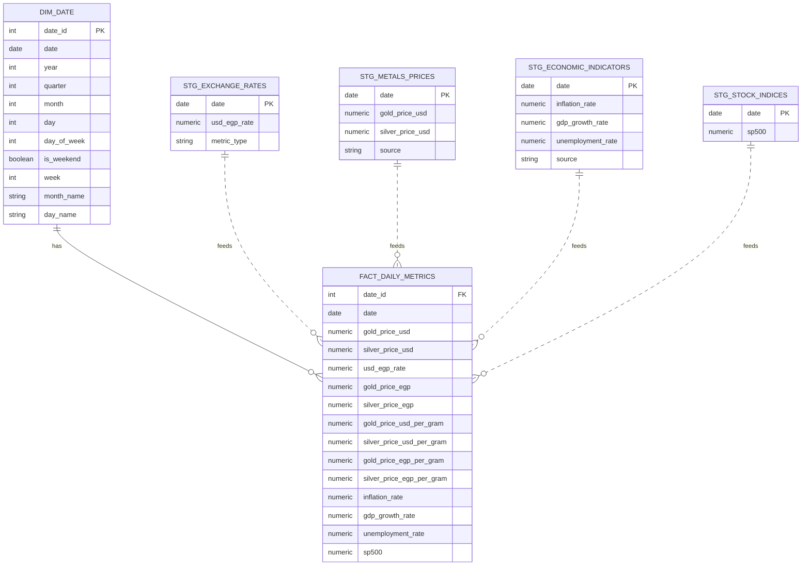

# Real Time EIS Pipeline

A comprehensive data pipeline that collects, transforms, validates, and analyzes Egypt's economic indicators in real-time using modern ETL architecture.

## Overview
**The Economic Intelligence System (EIS)** monitors key economic metrics including USD/EGP exchange rates, precious metals prices, macroeconomic indicators, and stock market indices. 
The system implements a star schema data warehouse on PostgreSQL, orchestrated by Apache Airflow with dbt for transformations and Soda Core for data quality validation,  and enables real-time monitoring through Power BI dashboards.

## Architecture

### Pipeline Stages

### Extract 
Python scripts fetch data from external APIs:
- USD/EGP exchange rates (Alpha Vantage)
- Gold & silver prices (Yahoo Finance)
- Economic indicators (World Bank API)
- Stock indices (Yahoo Finance)

### Transform
dbt models process data through layers:
- **Staging**: Clean and normalize raw data
- **Dimensional**: Date dimension table
- **Fact**: Consolidated daily metrics with calculated fields
- **Analytics**: Derived insights (returns, correlations, moving averages)

### Load
Transformed data stored in PostgreSQL data warehouse:
- Star schema design for optimal query performance
- Pre-calculated metrics (currency conversions, per-gram prices)

### Report
Power BI dashboards for business intelligence:
- Real-time monitoring of economic indicators
- Trend analysis and correlation insights
- Comprehensive dashboard guide available in `docs/PowerBI_Dashboard_Guide.md`
- Complete table reference for Power BI developers in `docs/DWH_Tables_Reference.md` 

## Data Warehouse Schema

#### The pipeline builds a **star schema** with:
- 1 Dimension: dim_date (temporal attributes)
- 1 Fact Table: fact_daily_metrics (15 consolidated metrics)
- 5 Analytics Views: Returns, moving averages, correlations, inflation impact

## Airflow DAG

**The EIS pipeline is orchestrated using Apache Airflow and follows an ELT (Extract, Load, Transform) pattern:**

## Key Features

- ETL pipeline with star schema data warehouse design using PostgreSQL
- Multi-source data integration (Alpha Vantage, Yahoo Finance, World Bank API)
- dbt-powered SQL transformations with data lineage tracking
- Automated data quality validation with Soda Core (referential integrity, calculated columns, range validation)
- Daily orchestration via Apache Airflow with parallel extraction and retry logic
- Advanced analytics views (correlations, moving averages, daily returns, inflation impact analysis)
- Currency conversion (USD to EGP) and per-gram precious metals pricing (troy ounce conversion)
- Power BI dashboards for comprehensive business intelligence and real-time monitoring
<!-- 
## Power BI Dashboards

The data warehouse supports a comprehensive set of Power BI dashboards for different analytical needs:

### Available Dashboards

1. **Executive Economic Overview** - High-level KPIs for decision makers
2. **Precious Metals Trading** - Monitor gold and silver prices across currencies
3. **Exchange Rate Monitoring** - Track USD/EGP exchange rate movements
4. **Economic Indicators** - Monitor macroeconomic health
5. **Correlation Analysis** - Understand relationships between economic factors
6. **Stock Market & Economic Relationship** - Analyze stock indices vs economic indicators
7. **Inflation Impact** - Analyze how inflation affects asset prices
8. **Daily Returns & Volatility** - Monitor daily price movements and volatility
9. **Time Series Analysis** - Long-term trend analysis
10. **Comparative Analysis** - Compare USD vs EGP pricing
11. **Data Quality & Completeness** - Monitor data pipeline health
12. **Mobile Executive Summary** - Quick mobile view of key metrics

### Documentation

- **Power BI Dashboard Guide**: Complete specifications for all 12 dashboards - see `docs/PowerBI_Dashboard_Guide.md`
- **Data Warehouse Tables Reference**: Complete table/column reference for Power BI developers - see `docs/DWH_Tables_Reference.md`

### Quick Start for Power BI

1. Connect Power BI to PostgreSQL database `eis_db`
2. Import core tables: `fact_daily_metrics` and `dim_date`
3. Create relationship: `fact_daily_metrics[date_id]` → `dim_date[date_id]`
4. Import analytics views as needed for specific dashboards
5. Follow dashboard specifications in the Power BI Dashboard Guide

 -->
