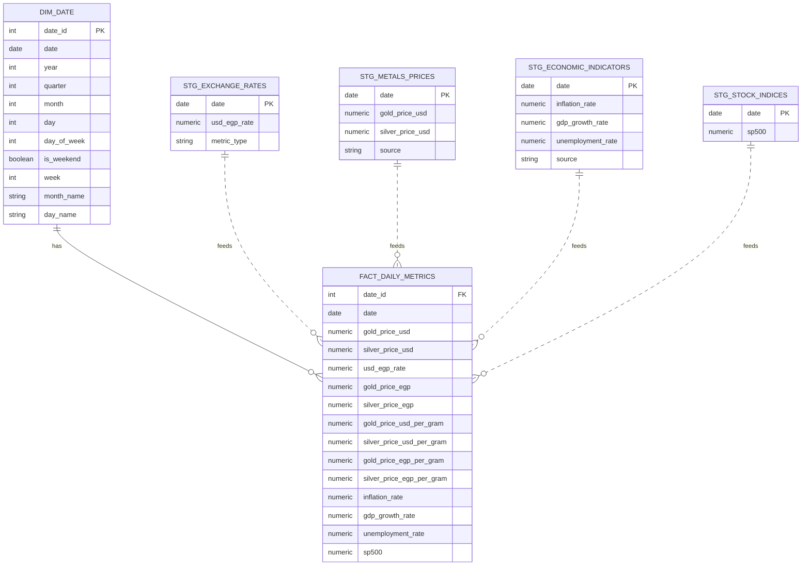

# Real Time EIS Pipeline

<!-- A comprehensive data pipeline that collects, cleans, validates, and visualizes economic data for real-time monitoring of Egypt's financial health.  -->

## Overview

The Economic Intelligence System (EIS) monitors and analyzes key economic indicators including:
- **USD ↔ EGP exchange rates** (daily)
- **Gold and silver prices** (daily, per troy ounce & per gram)
- **Economic indicators** (annual): Inflation, GDP growth, Unemployment
- **Stock market indices** (yearly): S&P 500, Dow Jones

## Data Warehouse ERD (Star Schema)

