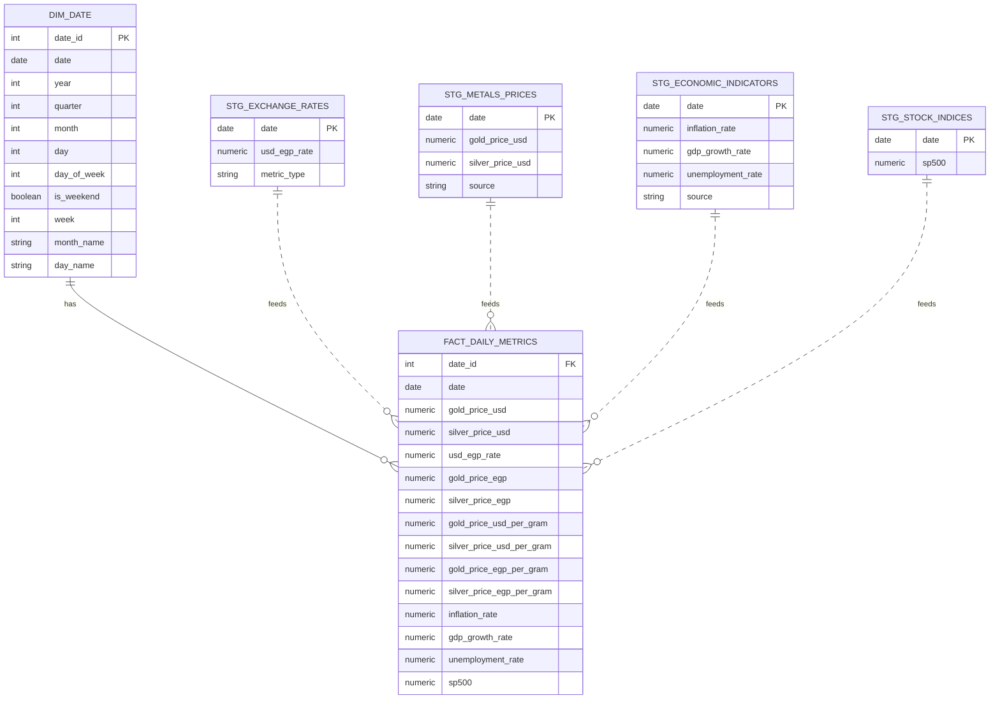

# Real Time EIS Pipeline

<!-- A comprehensive data pipeline that collects, cleans, validates, and visualizes economic data for real-time monitoring of Egypt's financial health.  -->

## Overview

The Economic Intelligence System (EIS) monitors and analyzes key economic indicators for Egypt's financial health.
The pipeline tracks **USD ↔ EGP exchange rates** (daily) and **gold and silver prices** (daily, per troy ounce & per gram).
Annual **economic indicators** include inflation, GDP growth, and unemployment rates sourced from the World Bank.
Yearly **stock market indices** include the S&P 500 and Dow Jones for global economic context.

## Pipeline Architecture

## Key Features

- ELT pipeline with star schema data warehouse design using PostgreSQL
- Multi-source data integration (Alpha Vantage, Yahoo Finance, World Bank API)
- dbt-powered SQL transformations with data lineage tracking
- Automated data quality validation with Soda Core (referential integrity, calculated columns, range validation)
- Daily orchestration via Apache Airflow with parallel extraction and retry logic
- Advanced analytics views (correlations, moving averages, daily returns, inflation impact analysis)
- Currency conversion (USD to EGP) and per-gram precious metals pricing (troy ounce conversion)
- Docker containerization for easy deployment and scaling

## Airflow DAG

The EIS pipeline is orchestrated using Apache Airflow and follows an ELT (Extract, Load, Transform) pattern:

## Data Warehouse ERD (Star Schema)

