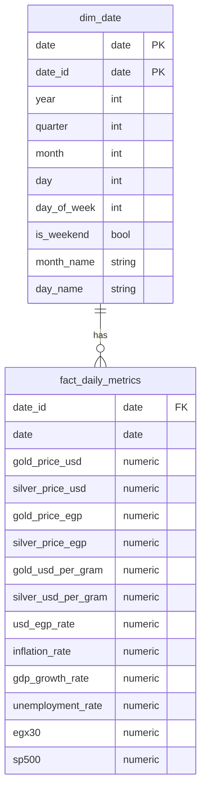

# EIS - Data Warehouse Architecture

## Overview

EIS implements a **Star Schema** data warehouse on PostgreSQL using dbt for transformations. The system collects economic data from multiple sources, processes it through staging layers, and builds analytical views for insights.

### System Architecture

- **Raw Layer**: Python scripts fetch data from APIs (Alpha Vantage, Yahoo Finance, World Bank)
- **Staging Layer**: dbt models clean and normalize raw data
- **Dimensional Layer**: Date dimension for time-based analysis
- **Fact Layer**: Consolidated metrics combining financial and economic data
- **Analytics Layer**: Derived insights including correlations, returns, and moving averages

### Key Features

- Star schema design for fast analytical queries
- Multiple data sources integrated seamlessly
- Automatic currency conversion (USD to EGP)
- Per-gram pricing for precious metals (1 troy ounce = 31.1035 grams)
- Economic correlation analysis
- Inflation regime detection
- Time-based trend analysis

## Star Schema Design

The Star Schema consists of:
- **1 Dimension Table**: `dim_date` with temporal attributes
- **1 Fact Table**: `fact_daily_metrics` with all economic indicators

This design enables efficient joins and fast analytical queries by minimizing table joins and using denormalized fact data.

